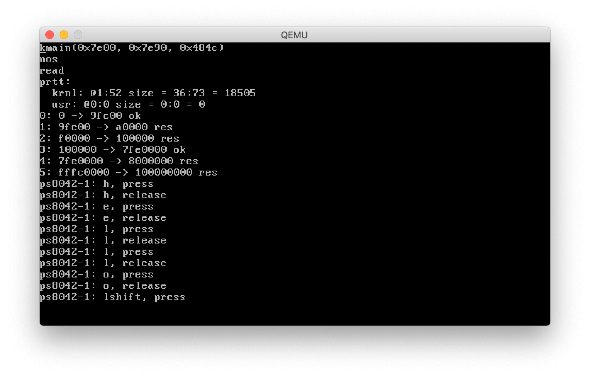

nOS is a from-scratch x86 (32-bit i386) operating system.

nOS is primarily developed as an exercise and for the purposes of education of the author. Nevertheless, it can be used as a high-quality example code-base and for code samples.

## Status

nOS running in `qemu-system-i386` on Mac OS Mojave, displaying:
- The arguments to `kmain`
- Lines indicating successful load of the kernel and the partition table
- A dump of the partition table
- A dump of the BIOS memory map
- A set of key-press events

### Features:
- [Robust build system](shake.hs)
- [Bootloader](src/boot)
  - [Memory map read](src/boot/boot16.nasm)
  - [Protected mode](src/boot/boot16.nasm)
  - [Kernel relocation](src/boot/boot32.nasm)
  - [GDT generation](src/boot/gdt_entry.nasm)
- [Partition table format](src/prtt)
- [Kernel-executable format](src/kexec)
- [Kernel](src/krnl)
  - [GDT generation](src/krnl/hpp/gdt.hpp)
  - [VGA text mode driver](src/krnl/hpp/term.hpp)
  - [ATA PIO driver](src/krnl/hpp/ata.hpp)
  - [PS8042 driver](src/krnl/hpp/ps8042.hpp)
  - [PS/2 keyboard scancode decode](src/krnl/hpp/scancode_set/2.hpp)

### Planned fatures:
1. PIC support
1. Physical memory manager
1. Memory virtualization. So far a flat physical memory model is used
  - Virtual memory manager
1. Kernel console
1. IRQ support
1. Kernel and bootloader debugging functionality
1. ?Load time relocation support
1. System shell
1. Inter-process communication
1. Kernel stripping

### Known issues:
- Does not enable the A20 line upon boot, relying on it being on by default.
- Kernel overrides the bootloader's GDTR to point to an equivalent GDT
- Driver API makes it easy for the consumer to write buggy code
